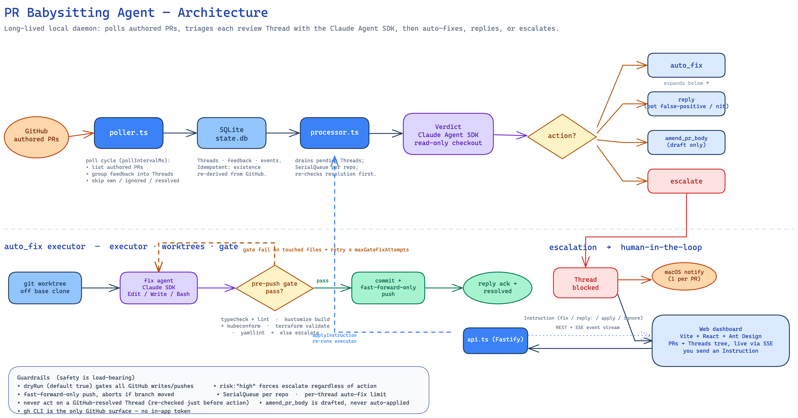

# Architecture

How the PR Babysitting Agent works, end to end. For terminology (Thread,
Verdict, gate, escalation, Instruction…) see [`../CONTEXT.md`](../CONTEXT.md);
for setup/config/run see [`../README.md`](../README.md).

> Source: [`architecture.excalidraw`](./architecture.excalidraw) — open in
> [Excalidraw](https://excalidraw.com) to edit, then re-export the PNG.

## The big picture

The agent is a single long-lived **local daemon** (`packages/server`) plus a
**web dashboard** (`packages/web`). It watches the PRs *you* authored on GitHub,
turns each piece of review feedback into a **Thread**, and drives that Thread to
one of three outcomes: an autonomous **fix + push**, an autonomous **reply**, or
an **escalation** that pulls you in. GitHub is reached only through your
authenticated `gh` CLI — there is no in-app token. State lives in a local SQLite
file under `~/.babysit-agent/`.

The pipeline is deliberately one-directional with a human-in-the-loop sink:
GitHub → poller → SQLite → processor → Verdict → action. Everything that can
mutate GitHub is gated behind `dryRun` and a set of guardrails (bottom of the
diagram).

## Stage by stage

### 1. Poll cycle (`poller.ts`)

Every `pollIntervalMs` the poller lists your authored open PRs (skipping
`ignoreRepos`), pulls all feedback, and groups it into Threads — one per
`(PR, threadKey)`, where a thread is an inline review-comment thread, a review
summary, or a standalone issue comment. It **skips your own comments and any
GitHub-resolved thread**. The result is *idempotent*: a Thread's existence is
re-derived from live GitHub state each poll, not remembered from first sight. New
activity on a previously `resolved`/`error` Thread re-opens it to `pending`
(unless the per-thread attempt limit is hit, which escalates instead).

### 2. State (`db.ts`, SQLite)

Threads, their feedback items, and an append-only event log persist to
`state.db`. This is what lets the daemon survive restarts: `pending` Threads
resume on boot, `blocked` Threads keep waiting for your Instruction. Status
lifecycle: `pending → in_progress → (resolved | blocked | error)`.

### 3. Processor (`processor.ts`)

Drains `pending` Threads through the pipeline. Work is serialized **per repo**
via a `SerialQueue` so two Threads in the same repo never race on a checkout or
push. Just before acting, it **re-checks GitHub resolution** (a Thread resolved
since it was queued is dropped) and applies the **loop-guard**: a Thread that has
already had `maxThreadAttempts` autonomous fixes escalates instead of fixing
again.

### 4. Verdict (`verdict.ts`, Claude Agent SDK)

The agent investigates the feedback in a **read-only checkout** of the PR branch
and returns a structured Verdict — `auto_fix`, `reply`, `amend_pr_body`, or
`escalate` — plus a `risk` level. Key rules baked into the prompt:

- **`risk: "high"` forces escalate**, regardless of the chosen action.
- Human pushback that needs no code change is escalated (you word the reply), not
  auto-replied — the one carve-out is `amend_pr_body`.
- Bot false-positives may be replied to autonomously, but only with cited
  file/line proof from the current code.

### 5. Acting on the Verdict (`executor.ts`)

| Action | What happens |
|--------|--------------|
| **reply** | Posts the drafted reply to the thread (or a top-level comment for summaries). → `resolved` |
| **amend_pr_body** | **Never auto-applied.** The rewritten description is drafted and the Thread is escalated; it's applied only when you approve with an `apply` Instruction. |
| **escalate** | Fires a notification, marks the Thread `blocked`. |
| **auto_fix** | Runs the fix loop below. |

#### The auto_fix loop

1. A throwaway **git worktree** is cut off the base clone (the base stays clean).
2. The **fix agent** (Claude SDK, `Edit`/`Write`/`Bash`) makes *only* the
   requested change.
3. The **pre-push gate** (`gate.ts`) self-verifies it: typecheck + lint for
   JS/TS repos, or a repo-type validator (`kustomize build` + `kubeconform`,
   `terraform validate`, `yamllint`). If no check applies, it can't self-verify →
   escalate.
4. If the gate fails **on files the agent touched**, the agent re-runs with the
   gate output to repair, bounded by `maxGateFixAttempts`. Failures in untouched
   (pre-existing) files escalate as-is.
5. On pass: commit and **fast-forward-only push** (aborts if the branch moved
   under us), then post an acknowledgement. → `resolved`. The worktree is always
   torn down, even on failure.

### 6. Human-in-the-loop (escalation)

An escalated Thread is marked **blocked**, which:

- fires a **macOS notification** (`notify.ts`), coalesced to one banner per PR;
- surfaces in the **web dashboard** (`packages/web`: Vite + React + Ant Design),
  which renders the PRs → Threads tree and streams live updates over SSE from the
  Fastify API (`api.ts`).

You respond with an **Instruction** (`fix …`, `reply: …`, `apply`, or `ignore`).
The API hands it to `applyInstruction`, which re-runs the executor on that Thread
with your directive overriding the stored verdict.

## Guardrails

Safety is load-bearing — these are not optional and should not be weakened:

- **`dryRun`** (default **true**) gates every GitHub write/push; in dry-run the
  pipeline still produces verdicts and logs the would-be action.
- **`risk: "high"` forces escalate** regardless of action.
- **Fast-forward-only push**, aborting if the remote branch advanced during the
  fix.
- **Serial per-repo queue** and a **per-thread auto-fix limit** (loop guard).
- **Never act on a GitHub-resolved Thread** — checked at poll time *and* again
  just before action.
- **`amend_pr_body` is drafted, never auto-applied** — it always requires your
  `apply`.
- **`gh` CLI is the only GitHub surface** — no in-app token, no Octokit path.

## Component map

| File | Responsibility |
|------|----------------|
| `index.ts` | entrypoint: load config, migrate db, sweep orphaned worktrees, start poller + processor + API |
| `poller.ts` | the poll cycle — discover PRs, group feedback, upsert Threads |
| `gh.ts` | every `gh` CLI call (PRs, comments, resolution state, push, reply, body edit) |
| `classify.ts` | author class (bot/human) and repo scope (`ignoreRepos`) |
| `verdict.ts` | Agent SDK verdict on a read-only checkout |
| `executor.ts` | acts on a Verdict; owns the auto_fix→gate→push loop |
| `gate.ts` | pre-push gate: build/test or repo-type validator |
| `worktrees.ts` | git worktree lifecycle + fast-forward push helpers |
| `processor.ts` | pipeline orchestration, SerialQueue, loop-guard, instructions |
| `db.ts` | SQLite schema, migrations, Thread/feedback/event queries |
| `api.ts` | Fastify REST + SSE; serves the built dashboard |
| `events.ts` / `queue.ts` / `notify.ts` / `config.ts` / `types.ts` / `cli.ts` | event bus, serial queue, notifications, config, domain types, read-only CLI |
| `packages/web/*` | React dashboard (PRs→Threads tree, Thread detail, Instruction box) |
